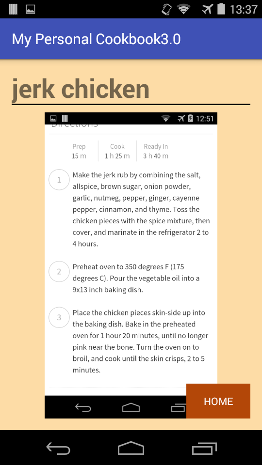

# Programmeerproject
 

##MY PERSONAL COOKBOOK
 
**Naam:Kim Schuiten 
Studentnummer: 10191089**

*In de app My Personal Cookbook kan je recepten aanmaken en bewaren zodat je nooit meer je favoriete recepten kwijt kan raken. Als je een recept wil toevoegen kan je dit intypen, of een foto maken van een recept uit je favoriete kookboek. Daarnaast kan je aan elk recept een foto toevoegen van het resultaat.*  
</img>
</img>
</img>
</img>
</img>
</img>
</img>
</img>

###Probleem
Stel je wilt dat heerlijke recept bewaren dat alleen je moeder kan maken. Of dat familierecept dat van generatie op generatie wordt doorgegeven. Dat wil je goed bewaren. Je zou het natuurlijk kunnen opschrijven op papier en bewaren in een mapje. Maar papier verouderd, vlekken maken je tekst onleesbaar en in het ergste geval houd je het recept te dicht bij het vuur en zie je je familierecept letterlijk in vlammen opgaan. Daarom is het handig om al je favoriete recepten bij elkaar te hebben in 1 handige app.

###Features
- Recepten opschrijven en opslaan
- Een foto maken van een recept en als recept opslaan. Bijvoorbeeld een recept uit een kookboek dat je heel vaak gebruikt.
- Screenshots maken van recepten online en deze als recept opslaan.
- Bij elk recept kan je ook een foto toevoegen van je gerecht.

###Bronnen
- Camera button: http://www.pocketmeta.com/wp-content/uploads/2015/02/Do-Camera-Icon.png
- Cookbook logo: https://img1.etsystatic.com/043/0/6923270/il_570xN.523364797_mf0v.jpg
- Document button: http://www.lifeisajourney.org/wp-content/uploads/2013/10/Watch-N-Listen-Doc-Button-Icon.png
- Plus button: http://media.pixcove.com/G/3/9/Plus-Desirable-Addition-Add-Free-Vector-Graphics-F-4445.jpg

Copyright (C) Kim Soraya Schuiten - All Rights Reserved
